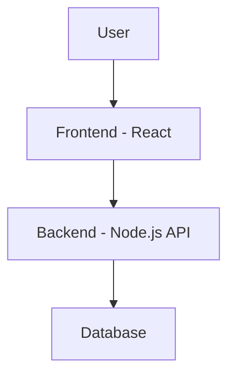
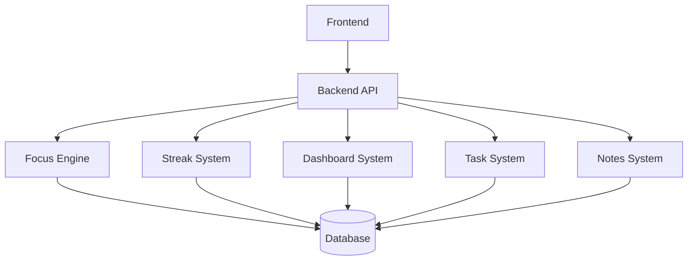

Athena is designed as a **modular, system-driven application** where multiple independent systems work together to deliver a complete productivity experience.

Instead of tightly coupling features, Athena separates responsibilities into distinct systems such as:
- Focus Engine (session execution)
- Streak System (consistency tracking)
- Dashboard System (analytics & visualization)
- Task & Notes System (productivity management)
- Leveling System (future gamification)
---
## High-Level Architecture

Athena follows a standard **client-server architecture**:

---
## System Interaction

Each system operates independently but shares data through the backend.

