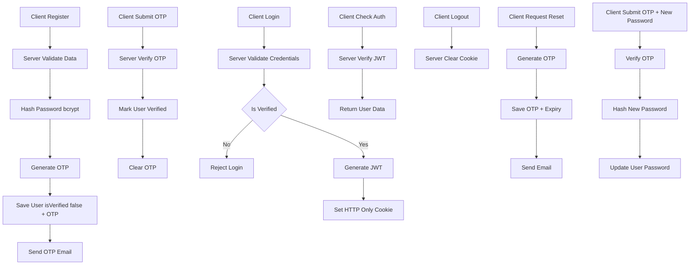

This module handles **user identity, login sessions, and account security**.

Authentication in Athena is **implemented** using:
- **JWT (JSON Web Token)** for authentication
- **HTTP-only cookies** for session storage
- **bcrypt** for password hashing (inside user model)
- **OTP email verification**
- **Password reset via OTP**    
- **Middleware-based route protection**
JWT tokens are signed using a secret defined in the environment variables and expire after **7 days**.

---
# Authentication Routes

## Public Routes
These routes **do not require authentication**.

| Method | Route                          | Purpose                       |
| ------ | ------------------------------ | ----------------------------- |
| POST   | `/auth/register`               | Register a new user           |
| POST   | `/auth/verify-email`           | Verify email using OTP        |
| POST   | `/auth/resend-code`            | Resend email verification OTP |
| POST   | `/auth/login`                  | Authenticate user             |
| POST   | `/auth/request-password-reset` | Send password reset OTP       |
| POST   | `/auth/reset-password`         | Reset password using OTP      |

## Protected Routes
These routes **require a valid JWT token**.

| Method | Route              | Purpose                        |
| ------ | ------------------ | ------------------------------ |
| GET    | `/auth/me`         | Get logged-in user details     |
| POST   | `/auth/logout`     | Logout user                    |
| GET    | `/auth/check-auth` | Check if user is authenticated |
These routes use the **auth middleware**. 

---
# Authentication Flow

### 1. Registration Flow
- User sends request to `/auth/register` with username, email, password, confirmPassword, fullName and agreeToTerms,
- Server:
    - Validates input
    - Hashes password using **bcrypt**
    - Generates **OTP**
    - Stores user with `isVerified = false`
    - Sends OTP via email
- User must verify email before login
### 2. Email Verification Flow
- User submits OTP to `/auth/verify-email`
- Server:
    - Validates OTP and expiry
    - Marks user as `isVerified = true`
    - Clears OTP fields
### 3. Login Flow
- User sends credentials to `/auth/login`
- Server:
    - Verifies email & password
    - Checks `isVerified`
    - Generates **JWT token**
    - Sends token via **HTTP-only cookie**
- Client:
    - Automatically stores cookie (no manual storage)

---

